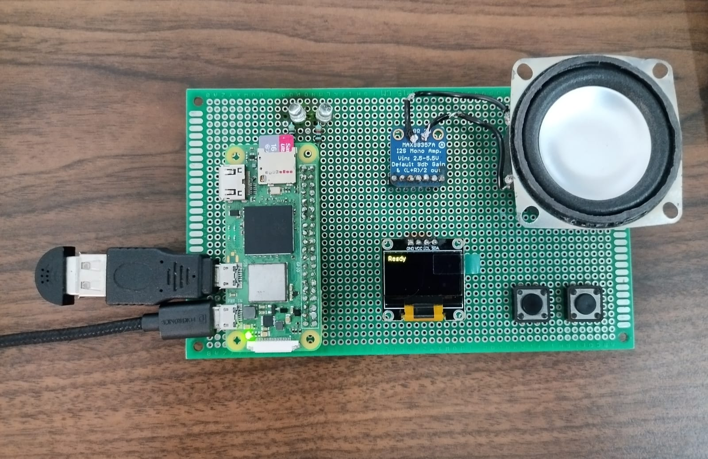

# Digital Cognitive Extension

<p align="center">
  
</p>

<p align="center">
  <b>An Offline AI-Powered Wearable Memory Assistant</b>
</p>

<p align="center">
  Raspberry Pi • Embedded Systems • Edge AI • Memory Augmentation
</p>

---

## Overview

Digital Cognitive Extension is a Raspberry Pi–based wearable cognitive assistant designed to function as an external memory system. The device captures, stores, organizes, and retrieves important information using local processing and embedded hardware interfaces.

The project focuses on creating a privacy-focused, offline-first memory assistant that reduces dependence on cloud services while providing intelligent memory augmentation through voice interaction, local storage, and embedded interfaces.

---

## Project Prototype

<p align="center">
  
</p>

---

## Features

- Local memory storage and retrieval
- SQLite-based memory database
- Embedded hardware integration
- OLED display interface
- Push-button interaction
- USB microphone support
- Speaker output support
- Offline-first architecture
- Privacy-focused design

---

## Hardware Components

- Raspberry Pi Zero W
- USB Microphone
- SSD1306 OLED Display
- MAX98357A Audio Amplifier
- 4Ω 3W Speaker
- Push Buttons
- MicroSD Card
- Portable Power Supply

---

## System Architecture

```text
User Input
    ↓
Microphone
    ↓
Memory Processing Engine
    ↓
SQLite Database
    ↓
Memory Retrieval System
    ↓
OLED Display / Speaker Output
```

---

## Software Stack

- Python
- SQLite3
- RPi.GPIO
- Pillow
- Luma OLED

---

## Installation

Clone the repository:

```bash
git clone https://github.com/Alwin111/Digital-Cognitive-Extension.git
cd Digital-Cognitive-Extension
```

Create a virtual environment:

```bash
python3 -m venv venv
source venv/bin/activate
```

Install dependencies:

```bash
pip install -r requirements.txt
```

---

## Repository Structure

```text
Digital-Cognitive-Extension/
│
├── smart_memory.py
├── oled_test.py
├── requirements.txt
├── README.md
├── .gitignore
│
├── docs/
├── hardware/
└── images/
    └── prototype.jpg
```

---

## Repository Notes

The following files are intentionally excluded from version control:

- AI model files
- Local databases
- Virtual environments
- Generated audio files
- Downloaded datasets

These resources can be recreated or downloaded separately and are not required for source control.

---

## Current Status

### Completed

- Raspberry Pi setup
- Memory storage system
- Memory retrieval system
- USB microphone integration
- OLED hardware integration
- Push-button interface design

### In Progress

- Full voice interaction pipeline
- Audio response system
- Complete hardware integration

---

## Future Work

- Wake-word detection
- Long-term memory management
- Local AI model integration
- Personal knowledge graph
- Context-aware memory retrieval

---

## Author

**Alwin Varghese**

Security Researcher — bi0s Hardware

Wireless Security • Embedded Systems • IoT Security • Edge AI

GitHub: https://github.com/Alwin111

---

## License

This project is intended for educational and research purposes.
